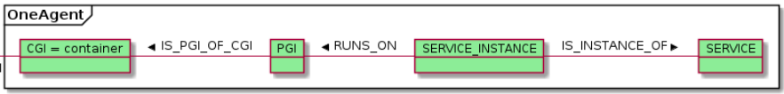

summary: Why Developers Love Dynatrace
id: why-devs-love-dynatrace
categories: codelevel
tags: codelevel
status: Published
authors: sergio.hinojosa

# Why Devs Love Dynatrace

## Introduction 
Duration: 10

## Pizza
Duration: 10
```java
package com.compuware.apm.datatypes.api.timeseries.config.keys;

import com.compuware.apm.pwh.api.ts2.metrics.key.RootMetricKey;
import com.compuware.apm.pwh.api.ts2.metrics.key.TsmMetricKey;

public final class PizzaMetric {

        private PizzaMetric() {}

        public static final TsmMetricKey PIZZA = TsmMetricKey.of(RootMetricKey.EXTENSION, "pizza key");
}
```


## Pizza 2
Duration: 10


{{ snippets/07/community/feedback.md }}
